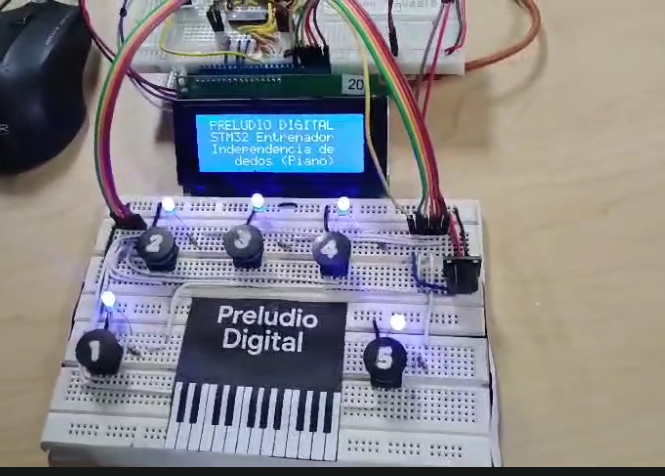

# Overview

**Preludio Digital** is an interactive training device designed and implemented by me to improve finger independence and coordination for pianists and musicians. The project was developed on an STM32 microcontroller as part of a Digital Electronics course.

Beyond the hardware, the main focus was on applying good programming practices: structured code organization, finite state machine architecture, clear logic separation, and maintainable design. This approach follows programming principles that support readability, scalability, and long-term maintainability.

The system combines hardware interaction (LEDs, buttons, buzzer, LCD) with software features such as serial command parsing, real-time event handling, and configurable game modes.

## Key Features

**Finite State Machines (FSMs):**
- **SystemFSM** → Handles serial communication and command parsing.
- **GameFSM** → Controls gameplay logic, LED patterns, timing, and scoring.

**Serial command interface (UART):**
- Configuration through Linux-like commands, e.g.: `D1 T2000 R10`
  - Difficulty = 1, Response time = 2000 ms, Rounds = 10.

**Interactive feedback:**
- LEDs guide user actions.
- Push buttons register responses.
- LCD and buzzer provide real-time feedback and game results.

**Game logic:**
- Multiple difficulty levels (from single finger to complex combinations).
- Round-based evaluation with accuracy percentage and performance messages.
- Extra modes: free play and memory challenges. 

## Skills Strengthened
- Embedded C programming on STM32.
- State machine architecture for modular and maintainable logic.
- Serial parsing and command execution for configurable systems.
- Real-time event handling with GPIOs, timers, and interrupts.
- User interface design combining hardware (LEDs, buttons, buzzer) and software (UART, LCD).

This project blends music training with embedded systems engineering, showcasing both creativity and solid software development practices.

**Main source code:** `Core/Src/main.c`

